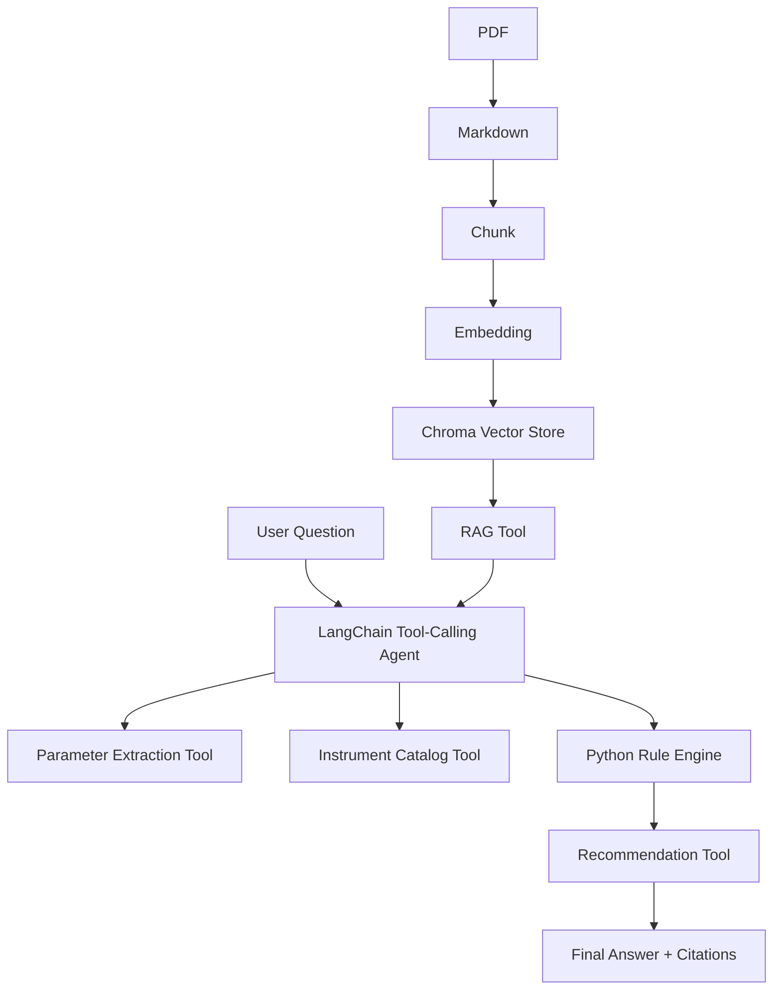
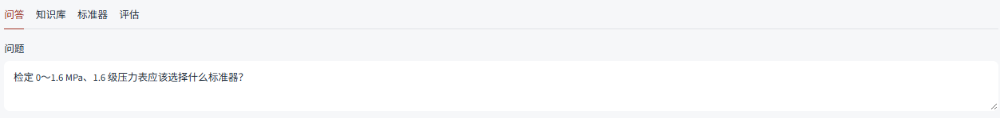
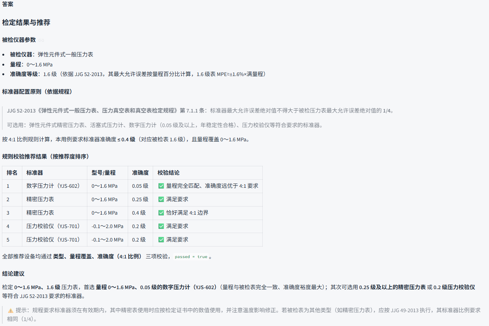
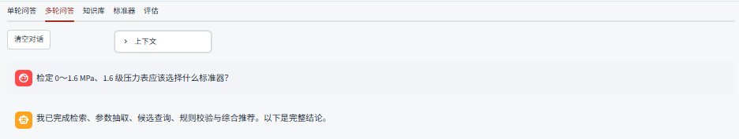
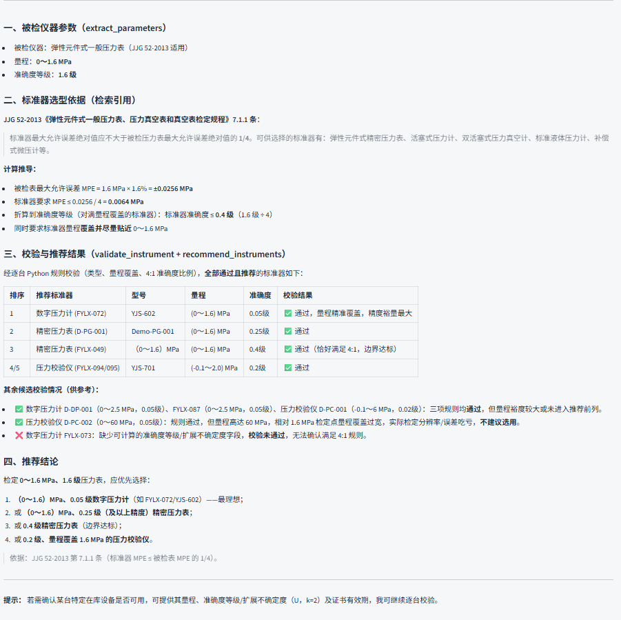
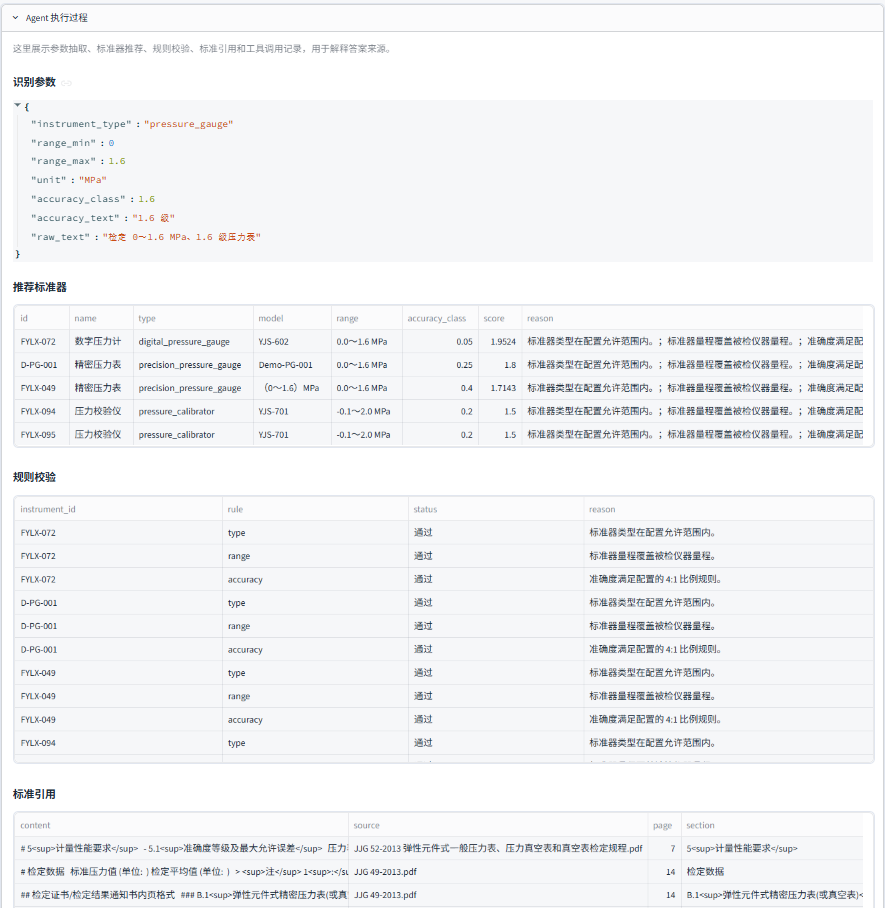
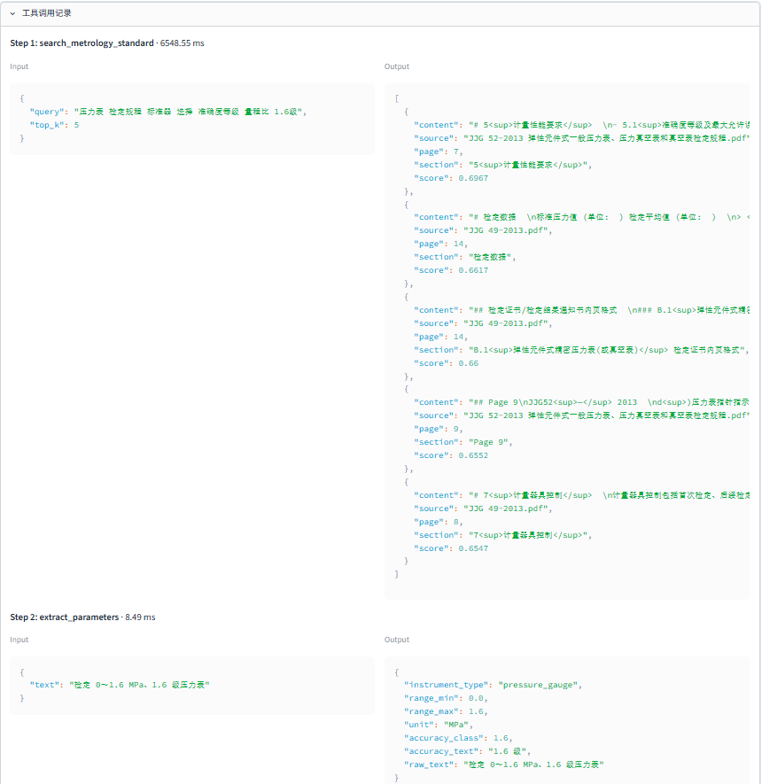
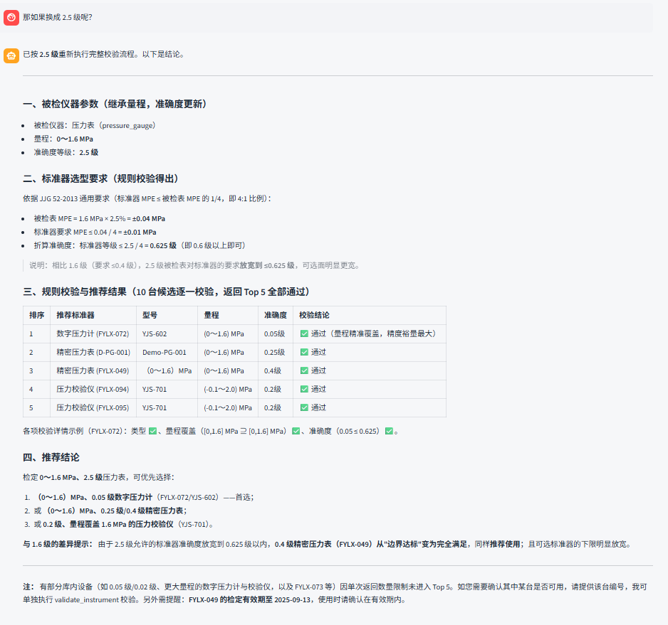

# MetrologyRAG-Agent

基于 RAG + LLM Agent + Tool Calling 的计量标准智能检索系统。项目面向国家计量标准、JJG 检定规程、JJF 校准规范等 PDF 文档检索，以及计量标准器选型和参数核验场景，适合作为 AI 应用工程师 / LLM Agent 方向求职作品集 Demo。

本项目不是生产级计量判定系统。`data/demo_standard.md` 和 `config/rules.yaml` 中的规则均为演示数据，不代表真实国家标准、JJG 或 JJF 条款。

## 系统架构



## 核心功能

- PDF 标准知识库：批量读取 `data/pdf/`，转换为带 source/page/section 的 Markdown。
- 语义检索：Markdown Header Splitter + Recursive Splitter 切块，Chroma 持久化检索。
- LangChain Agent：使用 `ChatOpenAI.bind_tools()` 接入 OpenAI-Compatible API。
- Tool Calling：注册 RAG、参数抽取、目录查询、规则校验、推荐五个工具。
- 结构化参数抽取：Pydantic Schema 输出仪器类型、量程、单位、准确度等级。
- 多轮问答：通过 Streamlit session state 保存聊天记录，并用 structured state 继承上一轮参数。
- Python 规则校验：量程覆盖、准确度比例由 Python 执行，不交给 LLM 判断。
- 标准器推荐：候选查询、逐个校验、过滤排序并输出推荐原因。
- Agent Trace：Streamlit 展示每一步 Tool Name / Input / Output / 耗时。
- 自动 Evaluation：从 `evaluation_cases.json` 计算 Tool Calling 成功率和端到端成功率。

## 技术栈

Python、Streamlit、LangChain、langchain-openai、ChromaDB、PyMuPDF / pymupdf4llm、pandas、Pydantic、python-dotenv。

## 项目结构

```text
MetrologyRAG-Agent/
├── app.py
├── README.md
├── requirements.txt
├── requirements-local.txt
├── .env.example
├── config/
│   ├── settings.py
│   └── rules.yaml
├── assets/
│   └── styles.css
├── data/
│   ├── pdf/
│   ├── markdown/
│   ├── chroma_db/
│   ├── instruments_demo.csv
│   ├── instruments.csv        
│   ├── evaluation_cases.json
│   └── demo_standard.md
├── docs/
│   └── standard_pdf_sources.md
├── images/
│   ├── 图1.png
│   └── ...
├── scripts/
│   ├── rebuild_vector_store.py
│   └── package_github.py
├── src/
│   ├── ingestion/
│   │   ├── pdf_to_markdown.py
│   │   ├── chunker.py
│   │   ├── embeddings.py
│   │   └── vector_store.py
│   ├── rag/
│   │   └── retriever.py
│   ├── agent/
│   │   ├── agent.py
│   │   └── prompts.py
│   ├── tools/
│   │   ├── rag_search_tool.py
│   │   ├── parameter_extract_tool.py
│   │   ├── instrument_query_tool.py
│   │   ├── rule_validation_tool.py
│   │   └── recommendation_tool.py
│   ├── rules/
│   │   └── validator.py
│   ├── evaluation/
│   │   └── evaluator.py
│   ├── models/
│   │   └── schemas.py
│   └── utils/
│       └── logger.py
└── tests/
    ├── test_rules.py
    └── test_tools.py
```

## 快速开始

```bash
git clone <your-repo-url>
cd MetrologyRAG-Agent
python -m venv .venv
source .venv/bin/activate
pip install -r requirements.txt
cp .env.example .env
streamlit run app.py --server.headless true --server.port 8509
```

DeepSeek 示例配置：

```dotenv
LLM_BASE_URL=https://api.deepseek.com
LLM_MODEL=deepseek-chat
LLM_API_KEY=sk-your-deepseek-key
```

Embedding 可使用 OpenAI-Compatible embedding 服务：

```dotenv
EMBEDDING_PROVIDER=auto
EMBEDDING_BASE_URL=https://api.openai.com/v1
EMBEDDING_MODEL=text-embedding-3-small
EMBEDDING_API_KEY=sk-your-embedding-key
```

如果使用本地 `BAAI/bge-m3`，先自行下载模型到项目内：

```text
models/bge-m3/
```

然后在 `.env` 中配置：

```dotenv
EMBEDDING_PROVIDER=auto
LOCAL_EMBEDDING_MODEL=./models/bge-m3
```

未配置 LLM 或 Embedding API 时，页面仍可打开。LLM 未配置时会使用本地规则化演示流程；Embedding 未配置时会使用轻量 hash embedding fallback，适合 Demo 和测试，不适合真实语义检索效果评估。

## Demo 示例

用户输入：

```text
检定 0～1.6 MPa、1.6 级压力表应该选择什么标准器？
```

Agent 执行流程：

```text
搜索标准 -> 参数抽取 -> 查询设备 -> Python 规则校验 -> 推荐 -> 标准引用
```

示例输出会包含推荐设备、型号、量程、准确度等级、Python 校验结果和检索引用。

## 界面预览

单轮问答：





多轮问答：











多轮问答中，页面会保存两类上下文：

- `chat_history`：最近若干轮用户问题和助手回答，供 LLM 理解对话语境。
- `structured_state`：上一轮结构化参数、推荐结果和标准引用，供程序在追问中补全省略信息。

例如第一轮询问 `0～1.6 MPa、1.6 级压力表` 后，第二轮输入 `那换成 2.5 级呢？`，系统会继承上一轮的仪器类型和量程，只更新准确度等级。

## 数据说明

公开仓库默认使用 `data/instruments_demo.csv`，其中包含 10 条虚构 Demo 标准器，厂家统一为 `Demo Manufacturer`。

本地如果存在 `data/instruments.csv`，系统会优先读取这份目录，便于接入真实标准器台账。该文件默认被 `.gitignore` 排除，避免把序列号、科室、有效期等内部数据误提交到公开 GitHub。

所有设备数据仅用于系统功能演示。真实业务中应补齐标准器唯一标识、证书有效期、测量范围、准确度等级或不确定度字段，并由专业人员复核。

## 规则引擎说明

当前实现了三类通用规则：

- 类型匹配：被检仪器类型映射到允许使用的标准器类型列表。
- 量程覆盖：标准器量程需要覆盖被检仪器量程，并支持同量纲单位换算。
- 准确度比例：标准器准确度按配置比例优于被检仪器，例如压力表规则使用 `4:1`。

规则参数通过 `config/rules.yaml` 配置，Python 代码负责执行通用校验逻辑。后续可以继续扩展不确定度、证书有效期、介质、环境条件、年稳定性、分段量程等规则。

推荐的长期维护方式是：

```text
Python 写通用规则能力
YAML 配不同仪器类型的规则参数
CSV/XLSX 放具体标准器数据
```

## PDF 知识库

本地演示可将 PDF 放入：

```text
data/pdf/
```

然后在 Streamlit 的“知识库管理”页点击：

```text
PDF → Markdown
重新构建知识库
```

如果 `data/pdf/` 和 `data/markdown/` 为空，系统会使用 `data/demo_standard.md` 构建演示知识库。

## Evaluation

`data/evaluation_cases.json` 内置 24 条测试问题。运行页面中的 `Run Evaluation` 后自动计算：

- Tool Calling Success Rate：要求 `expected_tools` 都被调用，且关键参数成功解析。
- End-to-End Task Success Rate：要求任务完成、参数抽取正确、必要工具被调用、至少一个推荐标准器通过规则校验，且最终答案包含有效引用。
- `expected_device_hit`：单独标记是否命中测试集中的 golden `expected_device_ids`，用于观察数据回归，不作为真实标准器目录下端到端成功的唯一条件。
- 平均工具调用次数。
- 平均响应时间。


命令行运行：

```bash
python -m src.evaluation.evaluator
```

## 测试

```bash
pytest
```

测试不依赖真实 LLM API，覆盖规则校验、目录查询和推荐工具。


